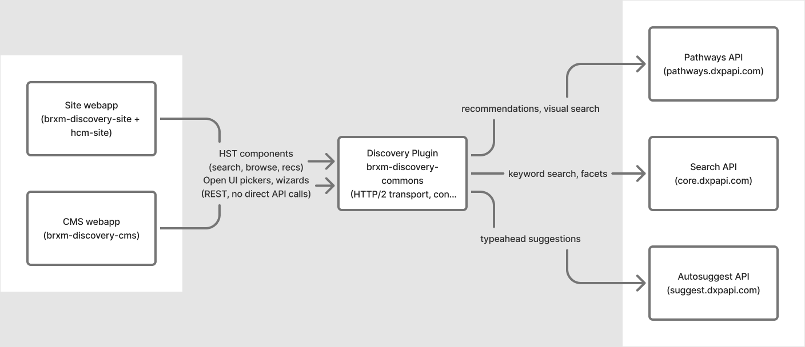

[Documentation home](README.md) > About

# About the Bloomreach Discovery Plugin

**brxm-discovery** connects [Bloomreach Discovery](https://documentation.bloomreach.com/discovery/) to [Bloomreach Experience Manager (brXM)](https://documentation.bloomreach.com/content). Discovery is Bloomreach's search and merchandising engine — it indexes your product catalog and powers keyword search, category browse, autosuggest, recommendation widgets, and visual (image-based) search. brXM is the content and page-composition layer: HST components render pages, editors manage content in Channel Manager, and the Page Model API feeds headless and SPA front ends.

This plugin is the integration between the two: a set of HST components, CMS editor extensions, and a server-side transport layer that call the Discovery API on your site's behalf, so no Discovery credentials are ever exposed to the browser.

> **Alpha — Early Development.** APIs, configuration schemas, HST component interfaces, and JCR node types are subject to change without notice between releases. Review release notes before upgrading.

---

## What the plugin provides

- **Search & browse** — keyword search and category browse pages with server-built facets, pagination, sort, did-you-mean, and keyword-redirect handling.
- **Autosuggest** — a search bar component with a live typeahead dropdown (query, attribute, and product suggestions).
- **Recommendations** — four widget types (product-keyed, category-keyed, global/personalized, and keyword-keyed), each configurable by content editors without code changes.
- **Visual search** — shoppers can search by uploading a photo; the plugin proxies the upload so Discovery credentials stay server-side.
- **Editorial curation** — hand-picked product and category highlight components for merchandising slots that don't need to be algorithmic.
- **CMS editor tooling** — Open UI pickers and step-by-step wizards for selecting products, categories, and recommendation widgets, embedded directly in document editing.
- **Analytics** — a server-side pixel service that reports impressions, clicks, and page views back to Discovery for ranking and A/B testing, with consent-gating support.
- **Headless-ready** — every component exposes its data through the Page Model API in addition to Freemarker, so the same components can power a traditional site or a decoupled React/SPA front end.

Discovery itself is read-only from the plugin's perspective — your product catalog is synced into Discovery by your commerce platform's connector; this plugin only queries and displays what's already indexed.

---

## Requirements

| Requirement | Version |
|---|---|
| brXM / Bloomreach Experience Manager | 17.0.0 |
| Java | 17 (LTS) |
| Maven | 3.8+ |
| A Bloomreach Discovery account | with a provisioned account ID and domain key |

The plugin runs across brXM's two separate runtimes — the CMS webapp and the site webapp — each with its own artifact. See [Installation](02-installation.md).

---

## Module overview

| Module | Artifact | Runs in |
|---|---|---|
| Commons | `brxm-discovery-commons` | Both runtimes (transitive dependency) |
| CMS | `brxm-discovery-cms` | CMS webapp |
| Site | `brxm-discovery-site` | Site webapp |
| HCM Site | `brxm-discovery-hcm-site` | Bundled automatically via the site artifact |

---

## Where to go next

| Task | Page |
|---|---|
| Add the plugin to your project | [Installation](02-installation.md) |
| Set up Discovery credentials | [Configuration](03-configuration.md) |
| Place search, browse, or recommendation components on a page | [Component Parameters](04-component-parameters.md) |
| Set up recommendation widgets or visual search | [Recommendations & Visual Search](05-recommendations-and-visual-search.md) |
| Let editors pick products, categories, and widgets in the CMS | [CMS Document Types & Pickers](06-document-types-and-pickers.md) |
| Configure analytics and consent | [Pixel Tracking & Consent](07-pixel-tracking.md) |

---

**Next:** [Installation](02-installation.md)
